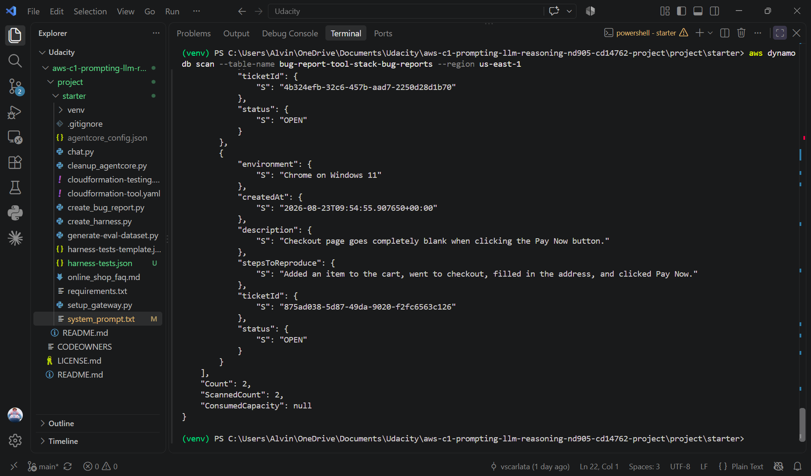
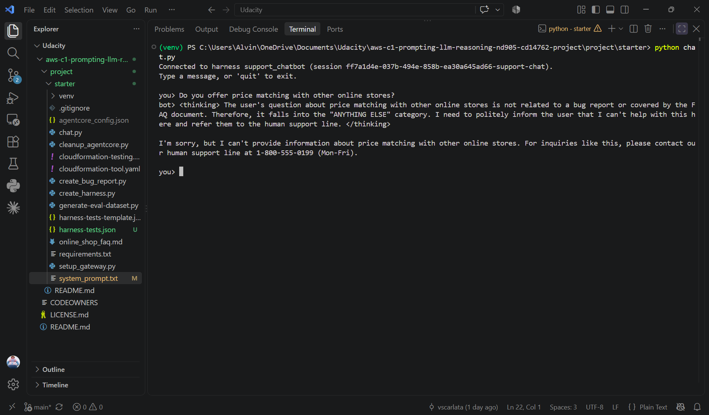

# Project: Customer Support Chatbot with the Amazon Bedrock AgentCore Harness

**Udacity — AWS Agentic AI Nanodegree — Course 1 Project (Prompting & LLM Reasoning)**

> **Status:** complete · three routes working in `chat.py` · Bedrock Evaluations
> Correctness **0.72** (9 prompts) · stand-out: injection hardening, edge-case tests,
> Guardrail · full rebuild guide in [`docs/`](docs/00-overview.md)

## Contents

1. [Overview](#overview)
2. [Architecture](#architecture)
3. [Project Structure](#project-structure)
4. [Quick Start](#quick-start)
5. [Step-by-Step Build](#step-by-step-build)
6. [Testing & Evidence](#testing--evidence)
7. [Stand-out Extensions](#stand-out-extensions)
8. [Rubric Mapping](#rubric-mapping)
9. [Submission Checklist](#submission-checklist)
10. [Study Notes](#study-notes)
11. [Clean Up](#clean-up-after-grading)
12. [References](#references)

---

## Overview

A customer support chatbot for a fictional online shop, built on the **Amazon Bedrock
AgentCore managed harness**. It routes every message to one of three behaviours —
using **one system prompt**, with no separate classifier or condition nodes:

1. **Bug reports** — collects `description`, `stepsToReproduce` and `environment`
   across a multi-turn conversation (one missing field at a time), calls the
   `create_bug_report` tool through an **AgentCore Gateway** to file a ticket in
   DynamoDB, and relays the real ticket ID.
2. **Platform questions** (orders, shipping, returns, payments, …) — answered strictly
   from the embedded FAQ (`online_shop_faq.md` via `{{FAQ}}`); questions the FAQ
   doesn't cover are handed off instead of guessed.
3. **Anything else** — politely redirected to the human support line
   (1-800-555-0199, Mon–Fri).

### A note on terminology (for reviewers)

The rubric still refers to **Bedrock Flows**, **Classifier nodes** and **Condition
nodes** because Bedrock Agents Classic closed to new customers on 30 July 2026 and the
course moved to its successor, **Bedrock AgentCore**.

| Rubric term (Bedrock Flow era) | What is implemented (AgentCore) |
|---|---|
| Bedrock Flow | `starter/system_prompt.txt` — a single system prompt run by the managed harness |
| Classifier node / prompt | The "decide which ONE category" routing instructions in the prompt |
| Condition node expressions | Natural-language conditional instructions per category |
| Separate Output node per path | Three behaviours in one response: bug report, FAQ answer, hand-off |
| "Bug Report Agent" | The `create_bug_report` tool via an AgentCore Gateway |
| `flow-tests.json` | `starter/harness-tests.json` |
| Flow diagram screenshot | The prompt + `chat.py` transcripts showing routing in action |

Official starter: <https://github.com/udacity/aws-c1-prompting-llm-reasoning-nd905-cd14762-project>

## Architecture

```
Customer ── chat.py / generate-eval-dataset.py ──► AgentCore managed harness "support_chatbot"
                                                     │  model us.amazon.nova-pro-v1:0 (greedy decoding)
                                                     │  system prompt + FAQ · session memory
                                                     ▼
                                          AgentCore Gateway (MCP, AWS_IAM)
                                                     │  bugreports___create_bug_report
                                                     ▼
                                          Lambda create_bug_report ──► DynamoDB (tickets)

Testing: harness-tests.json → output_eval_dataset.jsonl → S3 → Bedrock Evaluations (LLM-as-a-judge)
Safety:  Bedrock Guardrail (content + prompt-attack filters) attached on every invoke
```

| Component | Role |
|---|---|
| **AgentCore managed harness** | Agent loop, session memory, tool execution with `us.amazon.nova-pro-v1:0` |
| **AgentCore Gateway** | Exposes the Lambda as the tool `bugreports___create_bug_report` |
| **AWS Lambda** (`create_bug_report.py`) | Writes bug reports to DynamoDB, returns a `ticketId` |
| **Amazon DynamoDB** | Ticket storage (`bug-report-tool-stack-bug-reports`) |
| **Amazon Bedrock Evaluations** | Automated LLM-as-a-judge scoring (`Builtin.Correctness`) |
| **Amazon Bedrock Guardrails** *(stand-out)* | Independent layer blocking harmful content and prompt attacks |

## Project Structure

```
cs-bedrock-agentcore-chatbot-v1/
├── README.md                       ← this file
├── observations.md                 ← written analysis of the evaluation (deliverable)
├── docs/                           ← step-by-step rebuild guide (00-overview … 08-troubleshooting)
├── screenshots/                    ← evidence for every criterion
└── starter/
    ├── system_prompt.txt           ← ⭐ main deliverable: the chatbot's behaviour
    ├── harness-tests.json          ← ⭐ test suite (9 cases incl. 3 edge cases)
    ├── output_eval_dataset.jsonl   ← ⭐ generated evaluation dataset
    ├── chat.py                     ← terminal chat client (+ Guardrail attached)
    ├── create_harness.py           ← create/update the harness from the prompt
    ├── setup_gateway.py            ← create the gateway + register the tool
    ├── generate-eval-dataset.py    ← run the test suite → JSONL
    ├── eval-config.json / inference-config.json / output-config.json  ← evaluation job config
    ├── cloudformation-tool.yaml    ← DynamoDB + Lambda + IAM roles
    ├── cloudformation-testing.yaml ← S3 bucket + evaluation role
    ├── create_bug_report.py        ← Lambda code
    ├── online_shop_faq.md          ← FAQ embedded in the prompt
    ├── harness-tests-template.json · cleanup_agentcore.py · requirements.txt
```

Provided starter files are unchanged except `system_prompt.txt` (written), `chat.py`
(Guardrail attached) and the added test suite / evaluation configs.

---

## Quick Start

For someone running it for the first time (full explanation in [`docs/`](docs/00-overview.md)):

```bash
# 0. AWS CLI (us-east-1), Python 3.9+, Nova Pro model access
cd starter
pip install -r requirements.txt

# 1. Tool + gateway                                     → docs/02
aws cloudformation deploy --template-file cloudformation-tool.yaml \
  --stack-name bug-report-tool-stack --capabilities CAPABILITY_NAMED_IAM --region us-east-1
python setup_gateway.py

# 2. Harness from the prompt, then chat                 → docs/03, docs/04
python create_harness.py
python chat.py

# 3. Automated evaluation                               → docs/05
python generate-eval-dataset.py --tests-json harness-tests.json
```

---

## Step-by-Step Build

| Step | What | Notes |
|---|---|---|
| 1 | Deploy `cloudformation-tool.yaml` (DynamoDB, Lambda, gateway role, harness role); test the Lambda in isolation | [docs/02](docs/02-bug-report-tool-and-gateway.md) |
| 2 | `setup_gateway.py`: AgentCore Gateway (MCP, AWS_IAM) + target `bugreports` with `create_bug_report(description, stepsToReproduce, environment)` | [docs/02](docs/02-bug-report-tool-and-gateway.md) |
| 3 | Write `system_prompt.txt`: classify-first routing, slot-filling checklist (one question at a time), FAQ-only answers, hand-off, ticket-ID honesty, injection hardening | [docs/03](docs/03-system-prompt.md) |
| 4 | `create_harness.py` (Nova Pro, greedy decoding, `{{FAQ}}` injected) → iterate with `chat.py` | [docs/04](docs/04-harness-and-chat.md) |
| 5 | Test suite → `generate-eval-dataset.py` → testing stack → S3 → Bedrock Evaluations | [docs/05](docs/05-bedrock-evaluations.md) |
| 6 | Guardrail (stand-out) attached in `chat.py` | [docs/07](docs/07-standout.md) |

---

## Testing & Evidence

| # | Evidence | What it shows |
|---|---|---|
| 1 | `02_lambda_test_result.png` | `create_bug_report` Lambda tested in isolation |
| 2 | `03_dynamodb_item.png` | Ticket from the manual Lambda test in DynamoDB |
| 3 | `04_chat_bug_report.png` | Multi-turn bug report: description → steps → environment → `[tool call]` → ticket ID |
| 4 | `05_dynamodb_scan_from_chat.png` | The ticket from that chat persisted in DynamoDB |
| 5 | `06_chat_faq_covered.png` | Platform question answered from the FAQ |
| 6 | `07_chat_faq_uncovered.png` | Question not in the FAQ handed off to human support |
| 7 | `08_chat_other_request.png` | Off-topic request redirected to human support |
| 8 | `09_bedrock_evaluation_results.png` | Bedrock Evaluations — Correctness 0.72 over 9 prompts |
| 9 | `10_guardrail_config.png` | Guardrail content filters + prompt-attack filter (High, Block) |
| 10 | `11_guardrail_blocked.png` | Guardrail blocking a prompt-injection attempt |

### Bug report conversation → ticket


### Ticket persisted in DynamoDB


### FAQ question answered


### FAQ-uncovered question handed off


### Other request handed off


### Bedrock Evaluations results


### Results summary

Final runs scored **~0.72–0.78** on `Builtin.Correctness` across 9 prompts. The chatbot
reliably handles clear-cut cases in all three routes; its main weakness is filing a
ticket too eagerly on ambiguous or incomplete messages instead of asking a clarifying
question. Full analysis, including what was tried: [`observations.md`](observations.md).

---

## Stand-out Extensions

| Suggestion | Status | Where / evidence |
|---|---|---|
| Prompt-injection hardening | ✅ | Final rules block of `starter/system_prompt.txt`; test `t9` scored 1 |
| Edge-case tests | ✅ | `t7` ambiguous, `t8` very short, `t9` injection in `starter/harness-tests.json` |
| Bedrock Guardrails | ✅ | Content filters + prompt-attack filter (High, Block), attached in `starter/chat.py` — [config](screenshots/10_guardrail_config.png), [blocked](screenshots/11_guardrail_blocked.png) |
| Bedrock Knowledge Base for the FAQ | ⬜ | FAQ stays embedded in the prompt, as the instructions describe |


Details: [docs/07-standout.md](docs/07-standout.md).

---

## Rubric Mapping

| Criterion (AgentCore equivalent) | Where |
|---|---|
| Routing of the three request types | `starter/system_prompt.txt` — "decide which ONE of these three categories" + categories 1–3 |
| Bug report: collect description, steps, environment before calling the tool | Category 1 of the prompt; `04_chat_bug_report.png` |
| Tool invoked and ticket stored | `[tool call] bugreports___create_bug_report` in `04_chat_bug_report.png`; `05_dynamodb_scan_from_chat.png` |
| Platform questions answered from the FAQ only | Category 2 + `{{FAQ}}`; `06_chat_faq_covered.png` |
| Uncovered / other requests handed off | Categories 2→3 and 3; `07_chat_faq_uncovered.png`, `08_chat_other_request.png` |
| Tool resources (Lambda, DynamoDB, gateway) | `starter/cloudformation-tool.yaml`, `starter/setup_gateway.py`; `02_lambda_test_result.png`, `03_dynamodb_item.png` |
| Test suite covering all routes | `starter/harness-tests.json` (9 cases) |
| Automated evaluation | `starter/output_eval_dataset.jsonl`, evaluation configs, `09_bedrock_evaluation_results.png` |
| Written analysis of results | [`observations.md`](observations.md) |

---

## Submission Checklist

- [x] `starter/system_prompt.txt` handling bug reports, platform questions and other requests
- [x] Bug report tool + gateway deployed and verified (Lambda test, DynamoDB items)
- [x] Multi-turn bug report ending in a real ticket ID
- [x] FAQ-covered, FAQ-uncovered and other-request conversations
- [x] `starter/harness-tests.json` and `starter/output_eval_dataset.jsonl`
- [x] Bedrock Evaluations job + `observations.md`
- [x] Evidence screenshots

## Study Notes

| | |
|---|---|
| [00 Overview](docs/00-overview.md) | [05 Bedrock Evaluations](docs/05-bedrock-evaluations.md) |
| [01 Setup](docs/01-setup.md) | [06 Testing & submission](docs/06-testing-and-submission.md) |
| [02 Bug report tool & gateway](docs/02-bug-report-tool-and-gateway.md) | [07 Stand-out](docs/07-standout.md) |
| [03 System prompt](docs/03-system-prompt.md) | [08 Troubleshooting](docs/08-troubleshooting.md) |
| [04 Harness & chat](docs/04-harness-and-chat.md) | |

## Clean Up (after grading)

```bash
cd starter
python cleanup_agentcore.py
aws cloudformation delete-stack --stack-name bug-report-tool-stack --region us-east-1
aws s3 rm s3://udacity-agentic-engineer-c1-eval-<account> --recursive   # empty the bucket first
aws cloudformation delete-stack --stack-name bug-report-testing-stack --region us-east-1
```

Also delete the Guardrail `bug-report-chatbot-guardrail`. Details:
[docs/06](docs/06-testing-and-submission.md#4-clean-up).

## References

- [AgentCore managed harness](https://docs.aws.amazon.com/bedrock-agentcore/latest/devguide/harness.html) · [AgentCore Gateway](https://docs.aws.amazon.com/bedrock-agentcore/latest/devguide/gateway.html)
- [Bedrock Evaluations](https://docs.aws.amazon.com/bedrock/latest/userguide/evaluation.html) · [Bedrock Guardrails](https://docs.aws.amazon.com/bedrock/latest/userguide/guardrails.html)

## License

Starter code © Udacity — see [LICENSE.md](LICENSE.md).
